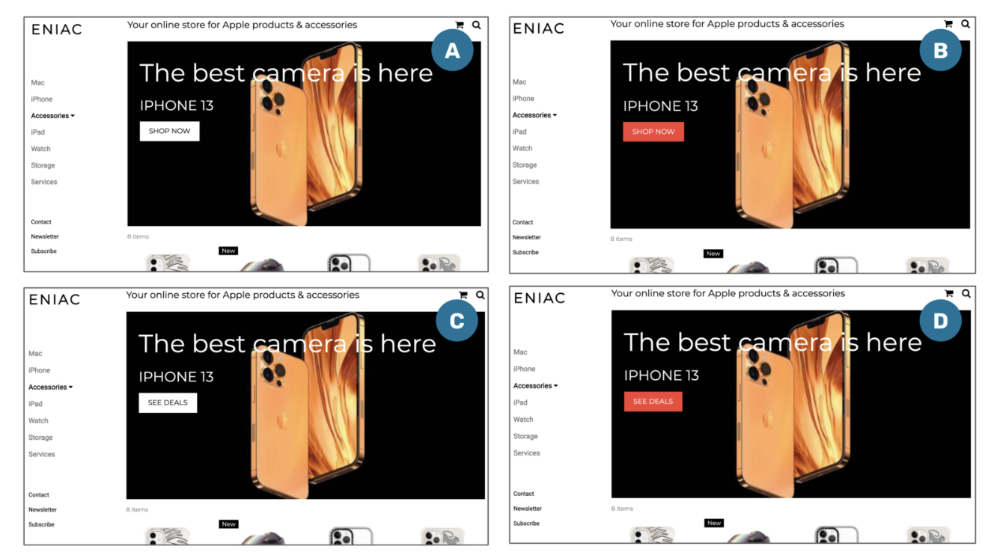
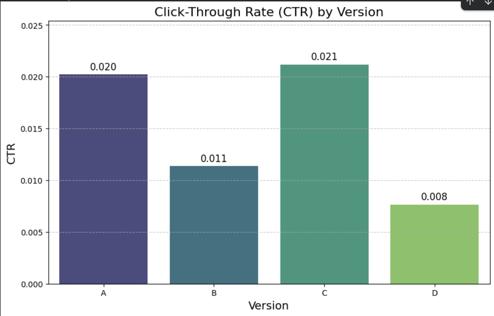
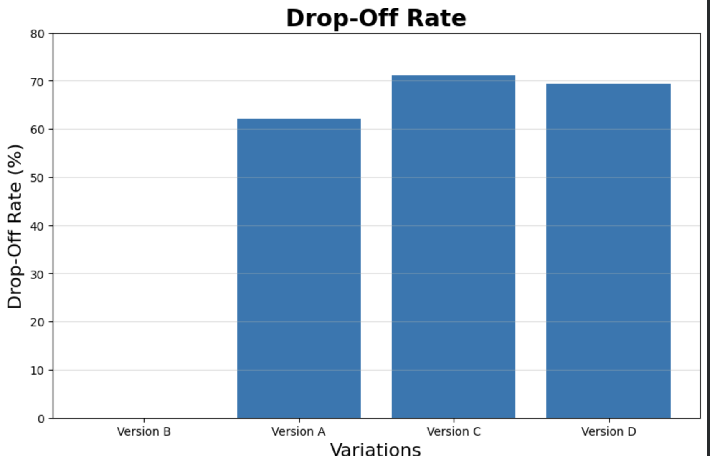
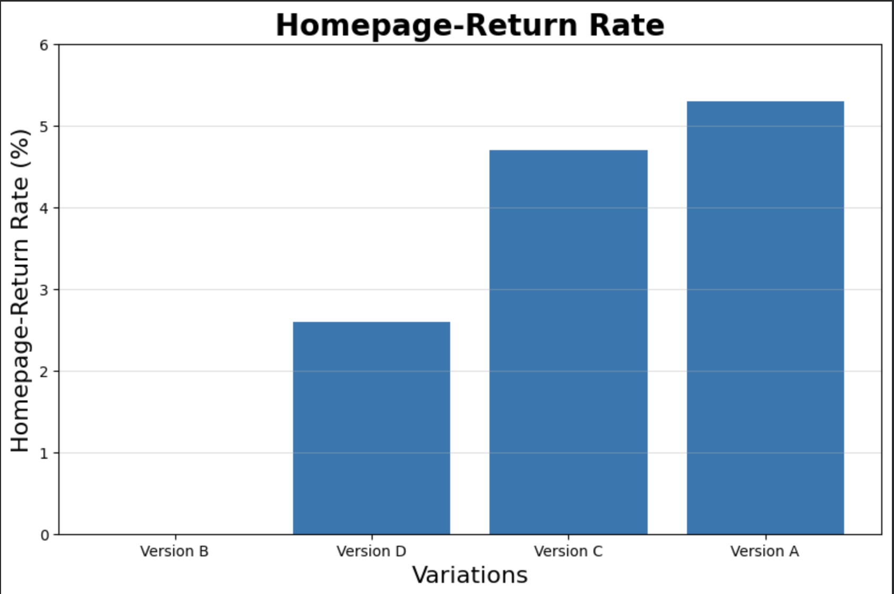
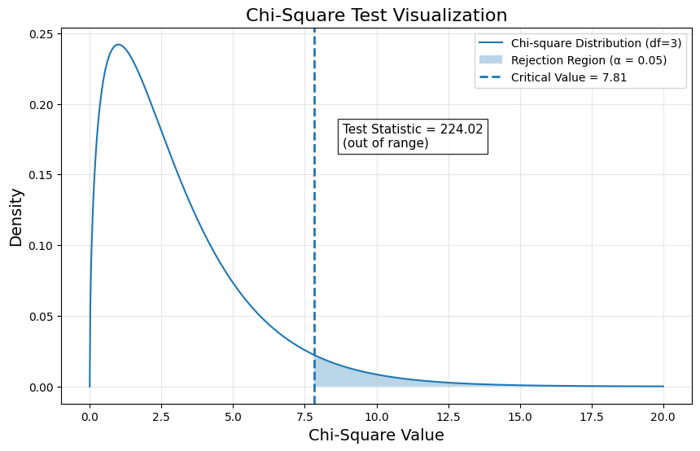

# 📊 ENIAC A/B Test – Homepage Optimization

# 🔍 Project Overview

This project analyzes an A/B test conducted on an e-commerce homepage to evaluate how different design variations influence user behavior and engagement.

The objective was to identify which version leads to the most effective user interaction and supports potential sales performance.

---

## 🧪 Test Setup

- **Duration:** 14 days (Nov 2 – Nov 16, 2021)
- **~25,000 users per version**

### 🖥️  Visitors per Version:
- Version A: 25,326  
- Version B: 24,747  
- Version C: 24,876  
- Version D: 25,233  

- **Statistical Test:** Chi-square test  
- **Significance Level:** α = 0.05 (95%)

### 🖥️ Variants Tested

- **Version A:** White “SHOP NOW”  
- **Version B:** Red “SHOP NOW”  
- **Version C:** White “SEE DEALS”  
- **Version D:** Red “SEE DEALS”

---

## 📈 Metrics

### 🎯 Primary Metric
- **Click-Through Rate (CTR)**  
  → Clicks / Total Visitors  

---

### 📉 Secondary Metrics
- **Drop-Off Rate** → Users leaving after clicking  
- **Homepage Return Rate** → Users returning to homepage  

---

## 🧪 Hypothesis

- **H0 (Null Hypothesis):**  
  Changes do not influence CTR or sales  

- **H1 (Alternative Hypothesis):**  
  Changes influence CTR or sales  

---

## 🧠 Methodology

- Data imported from CSV files  
- Data cleaning using pandas  
- CTR calculation  
- Contingency table creation  
- Chi-square test  
- Post-hoc pairwise comparisons  
- Bonferroni correction  
- Behavioral analysis  

---

## 📊 Results

### CTR Comparison

- **Version C:** Highest CTR (~2.1%)  
- **Version A:** Slightly lower (~2.0%)  
- **Versions B and D:** Significantly lower  

### Drop-Off Rate

- **Version A:** 62% (best)  
- **Version C:** 71% (worst)  

### Homepage Return Rate

- **Version A:** ~5.3%  
- **Version C:** ~4.7%  

### Chi-Square Distribution

## 🔬 Statistical Findings

- **p-value ≪ 0.05**  
- Significant differences between versions  
- **Null hypothesis rejected**

---

## 🔍 Post-Hoc Analysis

- Version C is **not statistically different** from Version A  
- All other comparisons are significant  

---

## ⚠️ Key Insight

The statistical significance observed in the test is primarily driven by the poor performance of Versions B and D, rather than a strong improvement in Version C. This highlights the importance of combining statistical testing with behavioral analysis.

---

## 🧠 Interpretation

Although Version C achieved the highest CTR, it is not statistically better than Version A.  
Additionally, Version C shows a significantly higher drop-off rate, indicating lower-quality engagement.

This demonstrates that **higher click rates do not necessarily indicate better performance**.

---

## 🏆 Final Recommendation

**Version A is the preferred option.**

It provides:
- Strong CTR performance  
- Lowest drop-off rate  
- More stable user engagement

---

## 🚀 Key Takeaways

- Statistical significance alone is not sufficient for decision-making  
- Behavioral metrics are essential to evaluate performance  
- Poor-performing variants can heavily influence statistical results  
- Data-driven decisions require both statistical and product thinking  

---

## 💯 Final Note

This project demonstrates how combining statistical testing with user behavior analysis leads to more reliable and meaningful business decisions.

---

## 📁 Project Structure

´´´
A-B-Testing-Eniac/
│
├── data/
│   └── processed/               # Cleaned dataset used for analysis
│
├── images/                      # Visualizations (CTR, drop-off, etc.)
│
├── notebooks/                   # Main notebook (EDA, hypothesis testing, insights)
│
├── README.md                    # Project documentation
│
└── requirements.txt             # Python dependencies
´´´

---

## 📗 Notebooks

---

## 📊 Data

All datasets are included in the repository:

- `/data/` → original datasets  
- `/data/processed/` → cleaned and aggregated data  

This ensures full reproducibility of the analysis.

---

## 🎬 Presentation

👉 [View Presentation](https://prezi.com/p/4gidyluojuil/?present=1)

---

## 🛠️ Tools & Technologies

- Python (pandas, numpy, scipy)  
- seaborn & matplotlib  
- Jupyter Notebook / Google Colab  

